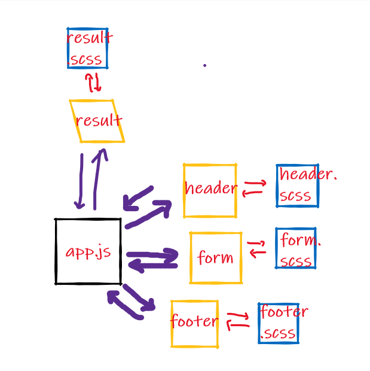

# SOLUTION - Component Based UI

## Lab Requirements

Students will be creating and styling a Counter application. Look for the following attributes

- `Header`, `Footer`, and `Counter` components to separate files
- Properly `export` them as defaults
- Import them into the `App` Component using ES6 `import` statement
- Proper state management
- Button Handlers
  - Bonus if they can wire both buttons with one handler

### Grading Standards & Notes

- Features
  - As noted
- Code Quality
  - Looking for proper class syntax
  - Good file naming and folder structure
  - Styles well written, using SASS variables/nesting and thought through beyond simple colors
- Testing
  - Not Required
- Deployment
  - Code Sandbox only.
- Documentation
  - Quality README

### Lab Assistance Notes

- The first and most important part of the lab assignment is to draw a process diagram of the starter code and state as events happen. Once the students understand that, they can move on.

# Run the app

- npm install
- npm start

# UML

## [sand pox link](https://codesandbox.io/s/naughty-pike-7l0m8?file=/src/app.js)

## [commits link](https://github.com/RulaAlqasem/resty/commits/master)

## [repo link ](https://github.com/RulaAlqasem/resty)

# lab 28 :
- [pull req link](https://github.com/RulaAlqasem/resty/pull/8)
- [repo link ](https://github.com/RulaAlqasem/resty)
- [netlify](https://6118b374fc2c0bdac36c65a1--peaceful-ardinghelli-789209.netlify.app/)
- [action ](https://github.com/RulaAlqasem/resty/actions)

# lab 29 :
- [pull req link](https://github.com/RulaAlqasem/resty/pull/8)
- [repo link ](https://github.com/RulaAlqasem/resty)
- [netlify](https://6118b374fc2c0bdac36c65a1--peaceful-ardinghelli-789209.netlify.app/)
- [action ](https://github.com/RulaAlqasem/resty/actions)
